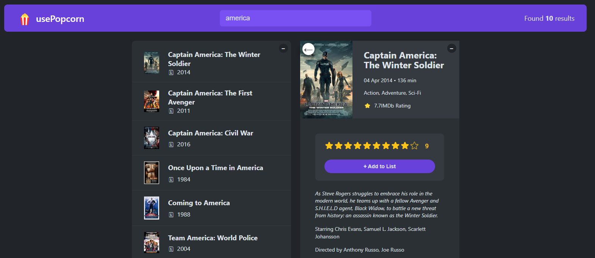

# 🎬 MovieRater App

**MovieRater** is a web-based application that lets users search for movies, rate them on a scale of 1–10, and manage a list of their rated movies. Built using **React** and **Vanilla CSS**, it delivers a fast, responsive, and clean experience.

---

## 📸 Preview

> 

---

## ✨ Features

- 🔍 **Movie Search**: Search movies by title using the OMDb API.
- ⭐ **Rating System**: Rate each movie from 1 to 10.
- ➕ **Add to List**: Save rated movies in a custom list.
- 🧾 **View Details**: See basic information like title, poster, release year, and IMDB rating.
- ❌ **Remove from list**: Remove rated movies movies from the custom list 
- 🧹 **Clear UI**: Responsive design with intuitive interactions and clean CSS styling.


---

## 🧰 Prerequisites

- Node.js (v14 or higher)
- npm or yarn
- OMDb API key (free from https://www.omdbapi.com/apikey.aspx)

## ⚙️ Installation Steps

1. **Clone the repository**

```bash
git clone https://github.com/Horlanrewajucode/movie-rating-app.git
cd movie-rating-app
````

2. **Install Dependencies**

````bash
npm install
# or
yarn install
````

3. **Set up environment variable**

````bash
VITE_OMDB_API_KEY=your_api_key_here
````

4. **Run the development server**

````bash
npm run dev
# or
yarn dev
````

5. Open in browser: http://localhost:5173

---


## 🧠 How It Works

- When a user types a movie name, the app queries the OMDb API in real time.

- Results are displayed as movie cards, showing posters, titles, years, and ratings.

- Users can select a movie and rate it using a custom 1–10 scale.

- After submitting a rating, the movie is added to a local list of rated movies.

- The rated list is managed with React state (it is persisted with localStorage).

---


## 🛠️ Tech Stack
- Frontend: React
- Styling: Vanilla CSS
- API: OMDb API
- Tooling: Vite, npm/yarn

---


## 📌 Future Improvements

- Add filter/sort options to rated list
- UI enhancements with animation or TailwindCSS

---


## 🙏 Credits
- Movie data powered by OMDb API
- Built with ❤️ using React and Vite
